# 🚀 StudyOS – Full Stack Study Productivity Web App

## 📌 Repository Name

`full_stack_study_web_app`

---

# 📚 StudyOS – Smart Student Productivity Platform

A modern full-stack MERN web application designed to help students improve focus, manage study sessions, track productivity, save notes, translate difficult words, and analyze study performance.

🌐 **Live Demo:**
[StudyOS Live Web App](https://student-productivity-mern-rhh2.vercel.app/)

💼 **LinkedIn:**
[Sumit Ghodke LinkedIn](https://www.linkedin.com/in/sumit-ghodke-a45a82205/)

---

# ✨ Project Description

StudyOS is a student productivity web application built using the MERN Stack.
This platform helps students manage their study workflow in one place.

Students can:

* Track study sessions
* Manage focus and break time
* Save study notes
* Store translated words for revision
* Listen to focus music
* Analyze study performance
* View study history
* Use authentication for secure access

The goal of this project is to help students study with better consistency, focus, and organization.

---

## ❗ Problems Solved By This Web App

StudyOS solves many common problems faced by students during studying and revision.

### 📚 Problems Addressed

* Students often cannot track how much time they actually study.
* Many students lose focus because they do not manage focus and break sessions properly.
* Students forget what subjects and topics they studied previously.
* Important study notes are often scattered or lost.
* Difficult translated words are hard to revise later.
* Students do not know which subject they study more or less.
* Most students lack a centralized productivity system for study management.
* Students need relaxing music and sounds to improve concentration during study sessions.

---

## ✅ How StudyOS Helps Students

With StudyOS, students can:

* Track focus duration and break duration
* Manage study sessions effectively
* Save important notes for future revision
* Save translated words with pronunciation support
* Listen to focus music while studying
* Analyze study productivity using charts and analytics
* View complete study session history

Students can check their previous study records including:

* 📖 Subject name
* 📝 Topic studied
* ⏱️ Focus duration
* ☕ Break duration
* 📅 Study date
* 🔁 Total sessions

This helps students understand their study habits and improve productivity over time.
## ⏰ Smart Focus & Break Alarm System

StudyOS includes a smart productivity timer system designed to help students maintain deep focus while studying.

### 🔔 Focus Session Alarm

When the focus duration is completed, the web app automatically plays an alarm sound notification to alert the student that the study session has ended.

This helps students:

* Maintain disciplined study sessions
* Avoid over-studying without breaks
* Improve time management and productivity

---

### ☕ Break Timer Alarm

After the break duration is completed, another alarm sound is automatically played.

This reminds students to:

* Return back to study on time
* Avoid long distractions during breaks
* Continue consistent focus sessions

---

### 🌐 Multitasking Support

While the focus timer is running, students can still:

* Open other browser tabs
* Explore Google resources
* Watch educational videos
* Read online articles
* Use coding platforms
* Use other study tools

Even if the student switches tabs or uses other web applications, the StudyOS timer continues running in the background and provides sound notifications when the timer finishes.

---

## 🌐 Cross-Platform Accessibility

StudyOS can be used on:

* 💻 Laptop
* 🖥️ Desktop
* 📱 Mobile Devices
* 📲 Tablets

The web app works on all modern browsers.

### Supported Browsers

* Google Chrome
* Microsoft Edge
* Firefox
* Brave
* Opera

⚡ The application is fully accessible on all devices, but the best and most responsive experience is currently optimized for **laptops and desktop screens**.

# 🔐 Authentication & Security

⚠️ Users must create an account and login before accessing all features of the web app.

### Important:

Users should safely store their email and password credentials.

Without signup/login, students cannot use the protected productivity features.

---

# 🛠️ Technologies Used

## Frontend

* React.js
* CSS
* JavaScript
* Axios

## Backend

* Node.js
* Express.js

## Database

* MongoDB
* Mongoose

## Authentication

* JWT Authentication
* bcryptjs

## Deployment

* Vercel
* Render / Backend Hosting

## Tools & Utilities

* Git & GitHub
* Thunder Client
* VS Code
* GitHub Copilot
* Environment Variables (.env)

---

# 🎯 Main Features

## 📊 Dashboard

* Track total sessions
* Track focus time
* Manage subjects
* Add study sessions

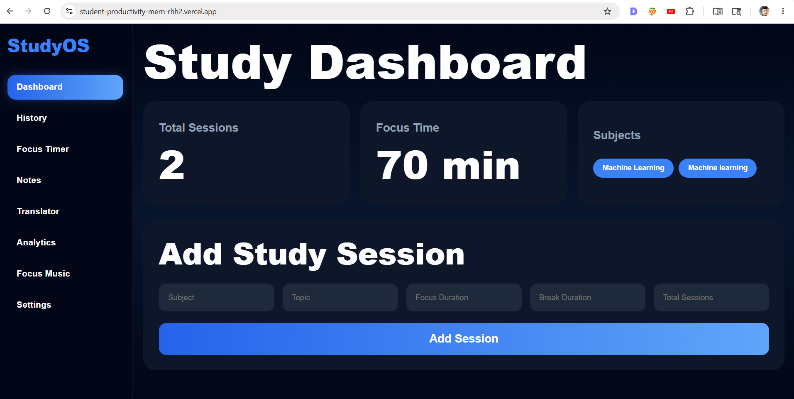

---

## ⏳ Focus Timer

* Focus session timer
* Break timer
* Productivity tracking
* Deep focus mode

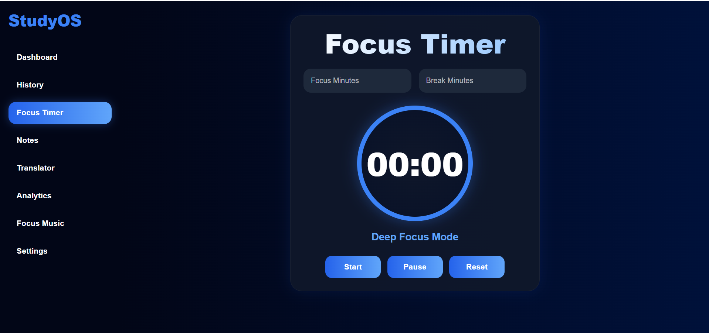

---

## 🔔 Break Finished Notification

* Alarm sound notification after break completion

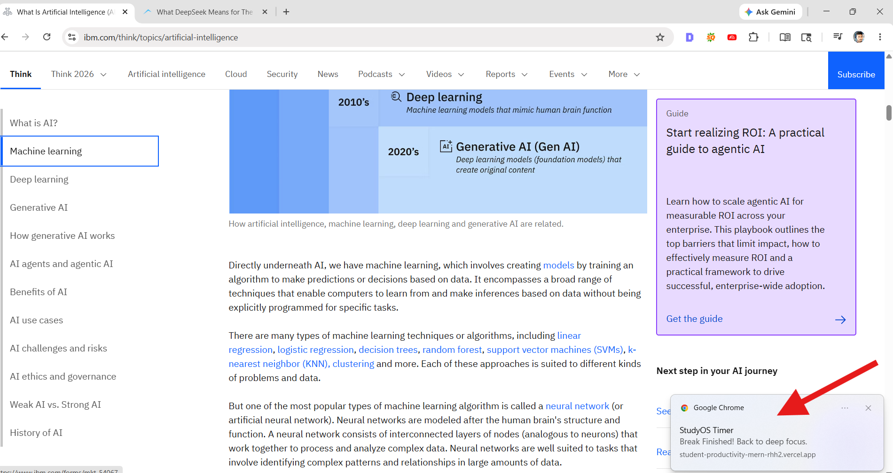

---

## ⏰ Focus Session Completion Alert

* Notification after focus session ends

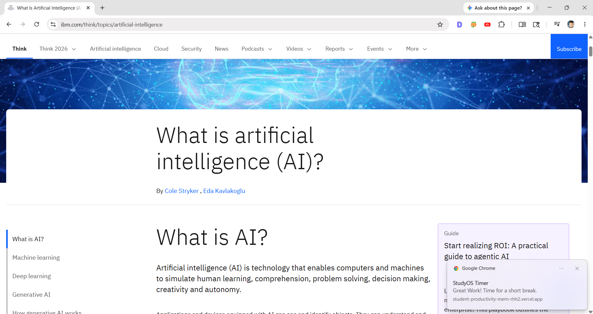

---

## 📝 Study Notes

* Save important notes
* Read notes later for revision
* Quick note management

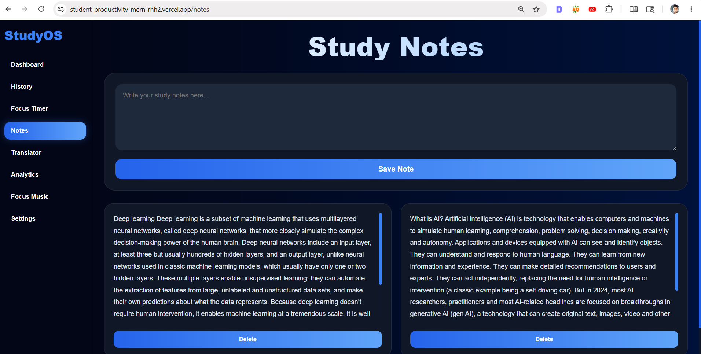

---

## 🌍 Smart Translator

* English → Marathi
* Marathi → English
* Translation support for learning

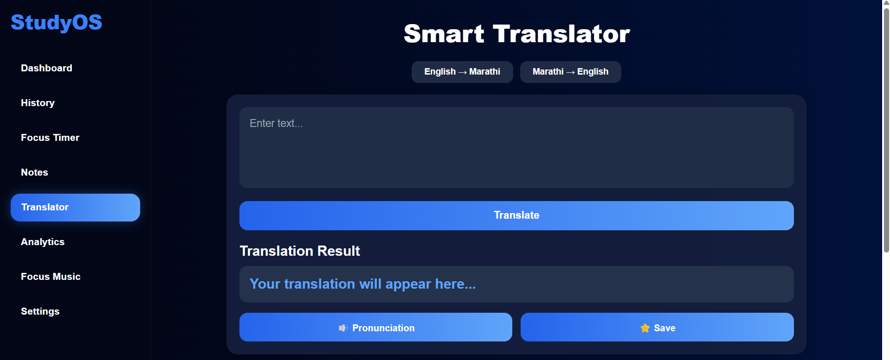

---

## 🔊 Pronunciation & Saved Words

* Save difficult words
* Listen to pronunciation
* Revision support

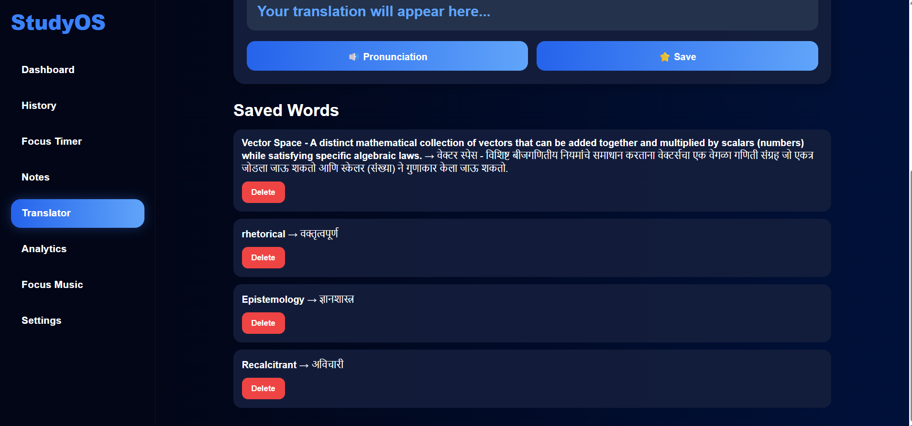

---

## 🎵 Focus Music

* Lofi music
* Rain sounds
* Nature sounds
* White noise

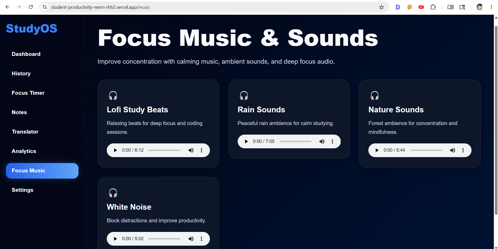

---

## 📈 Study Analytics

* Study performance tracking
* Subject distribution
* Focus time analytics
* Most studied topics

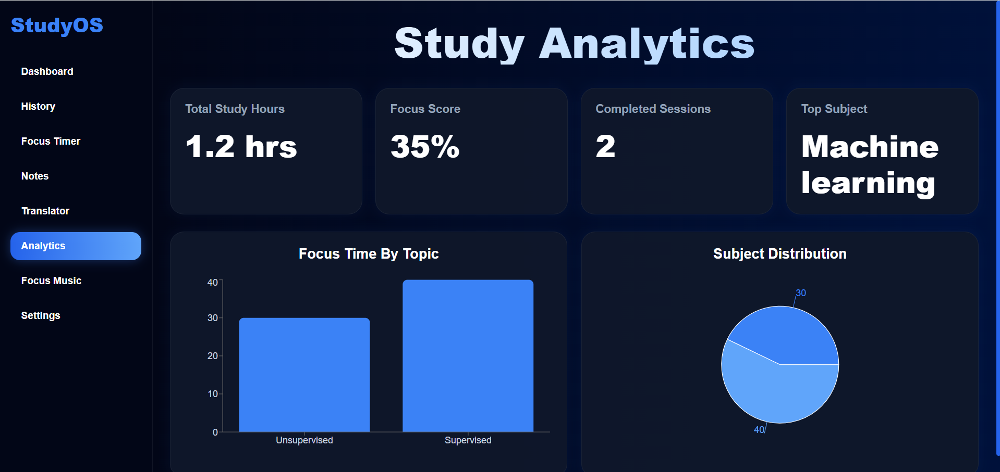

---

## 📜 Session History

* Track study sessions by date
* View subjects and topics
* Monitor focus and break duration

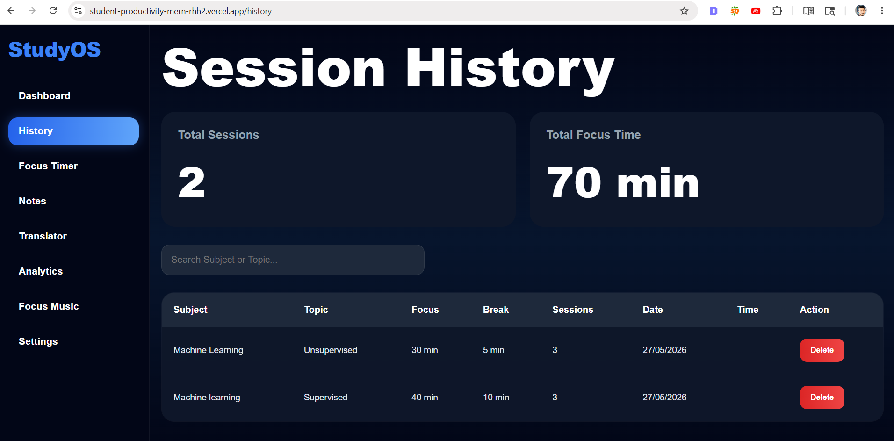

---

## 🔑 Signup & Login System

* Secure user authentication
* Protected routes
* User profile system

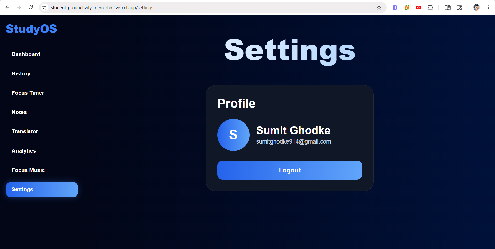

---

# 🧠 My Learning Experience While Building This Project

I come from a **non-technical background**, and building this project was a huge learning experience for me.

I built this full-stack MERN application using the help of LLM tools and AI assistance, but I still faced many real development challenges during the process.

While building this project, I learned:

* How MongoDB works
* How backend APIs work
* Authentication using JWT
* How environment variables (.env) work
* Git and GitHub commands
* Deployment process
* How to debug frontend and backend issues
* How to use Thunder Client for API testing
* How to explore large codebases
* How to fix errors using browser console logs
* How to understand project folders and files
* How GitHub Copilot helps in coding
* How to solve real-world coding problems

During development, I faced many errors and bugs, but I solved them one by one and successfully completed the project.

This project improved my confidence in:

* MERN Stack Development
* Debugging Skills
* Problem Solving
* Project Building
* Real-world Development Workflow

---

# 🚀 Future Improvements

* AI-powered study recommendations
* Pomodoro analytics improvements
* Mobile app version
* Cloud note backup
* Dark/Light themes
* Daily productivity reports
* AI chatbot study assistant

---

# ⭐ Support

If you like this project, consider giving it a ⭐ on GitHub.

---

# 👨‍💻 Author

**Sumit Ghodke**
AI & Data Science Learner
MERN Stack Developer

🔗 LinkedIn:
[Connect on LinkedIn](https://www.linkedin.com/in/sumit-ghodke-a45a82205/?utm_source=chatgpt.com)
